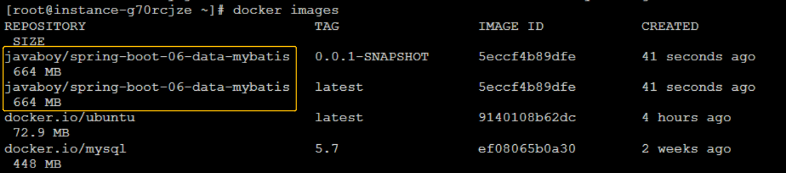
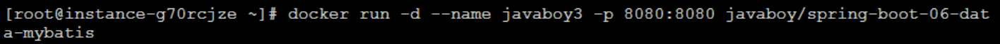
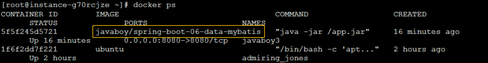

# 课程实践二：Restful+Docker

 ### 一. 实践任务

1. 实现简单的REST风格单体Web应用
2. 使用docker将其封装为镜像，镜像跑起来能在本机访问到相应API

### 二. 操作

#### 2.1 编写web应用

1. **采用springboot进行开发，选择Mybatis操作数据库**

   关键代码：Controller层对Restful风格请求做映射

   ```java
   @RestController
   public class StuController {

       @Autowired
       StuMapper stuMapper;

       @GetMapping("/api/v1/student")
       public List<Stu> getStu() {
           return stuMapper.getStu();
       }

       @PostMapping("/api/v1/student")
       public Stu insertStu(Stu stu){
           System.out.println("POST请求收到");
           stuMapper.insertStu(stu);
           return stu;
       }

       @PutMapping("/api/v1/student")
       public Stu updateStu(Stu stu){
           System.out.println("PUT请求收到");
           stuMapper.updateDept(stu);
           return stu;
       }

       @DeleteMapping("/api/v1/student")
       public Stu deleteStu(Stu stu){
           System.out.println("DELETE请求收到");
           stuMapper.deleteStuById(stu.getStudentId());
           return stu;
       }

   }

   ```

2. **数据源配置**

   在application.yml中添加相关数据源配置，这里采用Druid数据源，并连接向百度云服务器上的Mysql数据库。

   ```java
   spring:
     datasource:
   #   数据源基本配置
       username: admin
       password: qf1998
       url: jdbc:mysql://106.12.114.48:3306/student1
       type: com.alibaba.druid.pool.DruidDataSource
   ```

   关于百度云服务器上Mysql的搭建以及Navicat连接服务器的数据库，操作参考：

   [Centos服务器安装并配置mysql，本地Navicate连接](https://blog.csdn.net/hhyihquk1/article/details/73543192)

   其中如果涉及到防火墙设置，参考[虚拟机下CentOS7装mysql8，在本地使用navicate连接--防火墙设置](https://blog.csdn.net/qq_28207005/article/details/103200017?utm_medium=distribute.pc_relevant_t0.none-task-blog-BlogCommendFromBaidu-1.add_param_isCf&depth_1-utm_source=distribute.pc_relevant_t0.none-task-blog-BlogCommendFromBaidu-1.add_param_isCf)

   Navicat操作云服务器上的数据库如图：

   


#### 2.2 docker操作

1. **docker安装**

   [docker安装步骤参考](https://blog.csdn.net/zhangbeizhen18/article/details/85239758)

2. **项目部署到docker上**

   [一键部署 Spring Boot 到远程 Docker 容器](https://blog.csdn.net/u012702547/article/details/100153799)

   关键操作：

   - 编写Dockerfile

     ```java
     FROM hub.c.163.com/library/java:latest
     VOLUME /tmp
     ADD target/spring-boot-06-data-mybatis-0.0.1-SNAPSHOT.jar app.jar
     ENTRYPOINT ["java","-jar","/app.jar"]
     ```

   - pom配置

     ```java
     <build>
     		<plugins>
     			<plugin>
     				<groupId>org.springframework.boot</groupId>
     				<artifactId>spring-boot-maven-plugin</artifactId>
     			</plugin>

     			<plugin>
     				<groupId>com.spotify</groupId>
     				<artifactId>docker-maven-plugin</artifactId>
     				<version>1.2.0</version>
     				<executions>
     					<execution>
     						<id>build-image</id>
     						<phase>package</phase>
     						<goals>
     							<goal>build</goal>
     						</goals>
     					</execution>
     				</executions>
     				<configuration>
     					<dockerHost>http://106.12.114.48:2375</dockerHost>
     					<imageName>javaboy/${project.artifactId}</imageName>
     					<imageTags>
     						<imageTag>${project.version}</imageTag>
     					</imageTags>
     					<forceTags>true</forceTags>
     					<dockerDirectory>${project.basedir}</dockerDirectory>
     					<resources>
     						<resource>
     							<targetPath>/</targetPath>
     							<directory>${project.build.directory}</directory>
     							<include>${project.build.finalName}.jar</include>
     						</resource>
     					</resources>
     				</configuration>
     			</plugin>
     		</plugins>
     	</build>
     ```

   - springboot项目打包

     双击package即可，项目上传到docker中

   - docker查看项目及运行

     - docker images：查看现有docker容器中镜像

       

     - 运行springboot项目镜像：

       ```java
       docker run -d --name javaboy -p 8080:8080 javaboy/项目名称
       ```

       

     - docker ps：查看docker中现在运行的进程

       

     

3. **本地运行**

   通过Postman在本地运行项目。

   - GET请求查看现有数据：

     

   - POST提交数据：

     

   - PUT修改数据：

     

   - DELETE删除数据：

     
